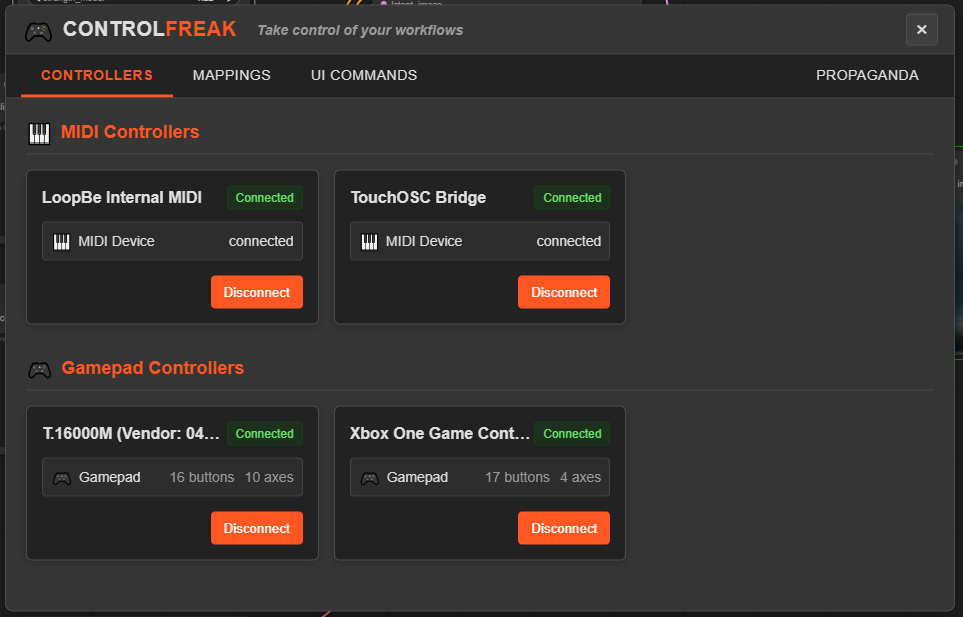
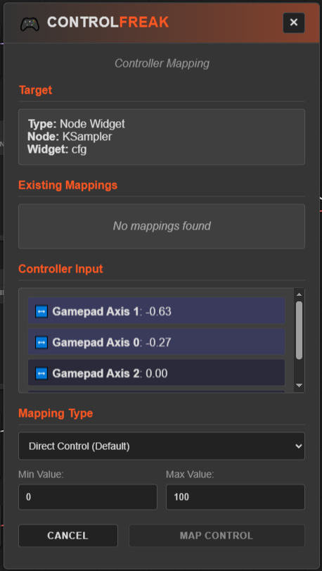
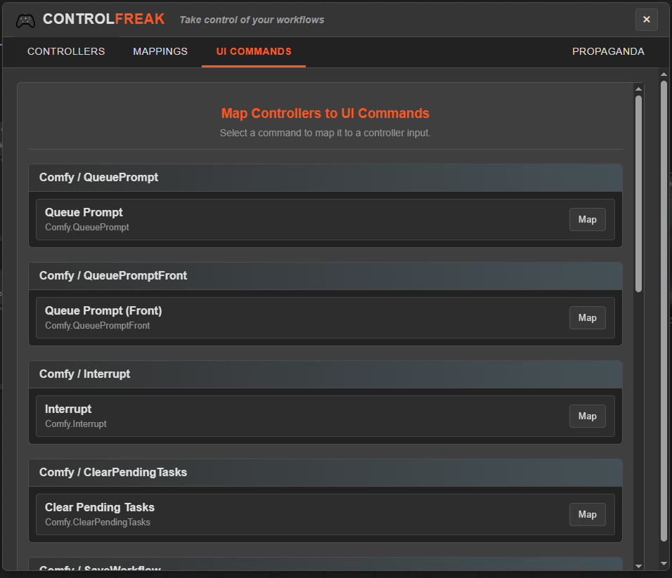
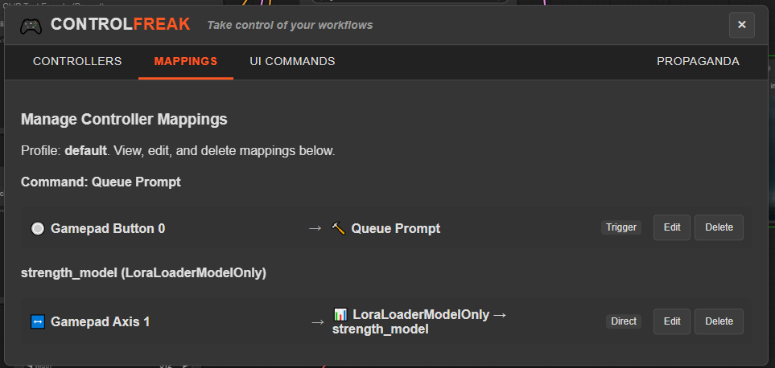

# 🎮 Control <span style="color: orange;">Freak</span> for ComfyUI

<div align="center">
  
  
  
  <a href="LICENSE"></a>
</div>

> *__Take control of your workflows__ - Universal MIDI & Gamepad mapping for ComfyUI*

Control <span style="color: orange;">Freak</span> gives you physical control over your ComfyUI workflows by mapping MIDI controllers, gamepads, and other input devices to any node parameter or UI element. Transform your image generation experience with tactile, responsive control. Obey the knobs! 

<p align="center">
  <i>Adjust sliders, toggle parameters, and execute commands with physical controllers</i>
</p>

<p align="center">
  
</p>

<!--toc:start-->
## Table of Contents
- [Features](#features)
- [Installation](#installation)
- [Usage](#usage)
  - [Accessing the Controller Panel](#accessing-the-controller-panel)
  - [Connecting Controllers](#connecting-controllers)
  - [Mapping Controller Inputs](#mapping-controller-inputs)
    - [To Node Parameters](#to-node-parameters)
    - [To UI Commands](#to-ui-commands)
    - [Quick Mapping / Unmapping](#quick-mapping--unmapping)
  - [Managing Mapping Profiles](#managing-mapping-profiles)
- [Supported Controllers](#supported-controllers)
  - [MIDI Controllers](#midi-controllers)
  - [Gamepads/Joysticks](#gamepadsjoysticks)
- [Configuration](#configuration)
- [Extending with New Controller Types](#extending-with-new-controller-types)
- [Related Projects](#related-projects)
- [License](#license)

- [Coming Soon](#coming-soon)
<!--toc:end-->

## Features

- **Versatile Mapping:** Map any controller input (buttons, axes, knobs, sliders) to:
    - Any node parameter (widgets like sliders, toggles, number inputs, dropdowns) via right-click "Standard Map..." mode.
    - Core ComfyUI commands (e.g., Queue Prompt, Interrupt, Save/Load Workflow, Clear Workflow, Canvas Zoom/Fit) via the Controller Panel.
- **Quick Mapping:** Instantly map a controller input to a widget using default settings via the right-click context menu (`Quick Map` option).
- **Quick Unmapping:** Instantly remove a *single* mapping from a widget via the right-click context menu (`Quick Unmap` option, only shown if one mapping exists).
- **Real-time Updates:** Parameters update instantly as you manipulate the controller.
- **Controller Panel:** Dedicated UI (`Edit -> Controller Mapping`) for:
    - Viewing available controller types (MIDI, Gamepad).
    - Listing detected and connected devices.
    - Manually connecting/disconnecting controllers.
    - Viewing and managing current mappings (including multiple mappings per widget).
    - Managing mapping profiles (Load, Save, Delete).
- **Supported Devices:** Built-in support for MIDI controllers and common gamepads/joysticks.
- **Value Conversion:** Automatically converts controller input ranges (e.g., 0-1) to the appropriate scale, type (INT, FLOAT, BOOLEAN, COMBO), and constraints (min, max, step) of the target widget.
- **Custom Range Overrides:** Specify custom min/max values during Standard Mapping for fine-grained control.
- **Mapping Profiles:** Save and load different sets of mappings for various workflows or controllers.
- **Visual Feedback:**
    - Highlights parameters during the standard mapping ("Learn") process.
    - Displays a subtle <span style="color:orange;">orange</span> background glow on widgets that currently have active mappings.
- **Auto-Reconnection:** Remembers previously connected controllers and attempts to reconnect them automatically on startup.
- **Extensible:** Designed to allow adding support for new controller types.

## Installation

Use the ComfyUI Manager, or.....

1. Navigate to your ComfyUI `custom_nodes` directory:
   ```bash
   cd /path/to/ComfyUI/custom_nodes
   ```
2. Clone this repository:
   ```bash
   git clone https://github.com/ryanontheinside/ComfyUI_ControlFreak.git
   ```
3. Restart ComfyUI.

## Usage

### Accessing the Controller Panel

After installation and restarting ComfyUI, you can access the main interface for ControlFreak:

- Go to the **Edit** menu in the ComfyUI menu bar.
- Select **Controller Mapping**.

This will open the Controller Panel, which is the central hub for managing devices and mappings.

### Connecting Controllers

1.  **Physical Connection:** Ensure your MIDI device or gamepad is physically connected to your computer via USB or other appropriate means.
2.  **Controller Panel:** Open the Controller Panel (`Edit -> Controller Mapping`).
3.  **Device List:** The panel will list detected controller types (MIDI, Gamepad) and specific devices found under each type.
4.  **Connect:** Click the "Connect" button next to the desired device. A notification should confirm the connection.
5.  **Auto-Detection:** Many devices might be detected and connected automatically upon startup or connection.

### Mapping Controller Inputs

#### To Node Parameters

This is the most common way to control specific aspects of your workflow. You have several ways to map parameters:

**1. Quick Map (Recommended for simple cases):**

- **Right-Click Directly on Widget:** Right-click on the interactive part of the widget you want to control (e.g., the number input field, the toggle switch).
- **Select "Quick Map '[Widget Name]'":** Choose the first Control Freak option in the context menu.
- **Move Controller:** Activate the desired controller input (button, axis, knob).
- **Done:** The first input detected will be instantly mapped to the widget using default settings appropriate for the widget type (e.g., absolute mapping for numbers/sliders, toggle for booleans). A notification will confirm the mapping, and the widget will get a subtle highlight.

**2. Standard Map (For more configuration):**

<p align="center">
  
</p>

- **Right-Click on Node (or Widget):** Right-click anywhere on the node containing the widget, or directly on the widget.
- **Select "Map Control..." -> Widget Name -> "Standard Map...":** Navigate the submenu to find the widget and choose "Standard Map...".
- **Learning Dialog:** A dialog box appears.
- **Activate Control:** Move the desired controller input.
- **Detection & Selection:** The dialog lists detected inputs. Click the one you want to use.
- **Configure (Optional):** Set custom min/max value overrides if needed.
- **Select Mapping Type:** Choose Direct, Toggle, Incremental, etc.
- **Map:** Click the **Map** button.

**3. Quick Unmap (If *only one* mapping exists):**

- **Right-Click Directly on Widget:** Right-click on the interactive part of a *mapped* widget.
- **Select "Quick Unmap '[Widget Name]'":** If only one mapping exists for this widget, this option will appear. Click it.
- **Done:** The single mapping is instantly removed, and the highlight disappears. A notification confirms the unmapping.

*(Note: If a widget has multiple mappings, you must use the Controller Panel (`Edit -> Controller Mapping` -> Mappings Tab) to manage or remove them.)*

**Visual Highlight:**

Widgets that currently have one or more active mappings assigned via Control <span style="color: orange;">Freak</span> will display a subtle <span style="color:orange;">orange</span> background glow for easy identification.

#### To UI Commands

You can also map controller inputs to execute core ComfyUI actions.

<p align="center">
  
</p>

1.  **Controller Panel:** Open the Controller Panel (`Edit -> Controller Mapping`).
2.  **Mappings Tab:** Navigate to the "Mappings" tab.
3.  **Add Mapping:** Click the "Add Mapping" or similar button.
4.  **Select Target:** Choose "Command" as the target type.
5.  **Select Command:** Browse or search the available ComfyUI commands listed.
6.  **Learning Dialog:** Click "Learn Control" (or similar) to open the learning dialog. Activate the desired control on your device.
7.  **Detection & Selection:** Click the detected input to select it.
8.  **Configure & Map:** Set options (like mapping type, often "Trigger" for commands) and click "Map".

Now, activating that controller input will execute the chosen ComfyUI command.

### Central Mapping Management

The Controller Panel provides a centralized location to view and manage all your mappings:

<p align="center">
  
</p>

1.  **Mapping List:** Shows all current mappings organized by target type (Node Parameters, UI Commands, ComfyUI Commands).
2.  **View Details:** For each mapping, view the associated:
    *   **Target:** What the controller affects (node/parameter, command)
    *   **Controller:** Which controller and input is mapped
    *   **Mapping Type:** Direct, Toggle, Incremental, etc.
    *   **Value Range:** Custom min/max values if set
3.  **Edit Mappings:** Select any mapping to:
    *   **Modify:** Change mapping type or value ranges
    *   **Reassign:** Map a different controller input to the same target
    *   **Remove:** Delete the mapping
4.  **Batch Operations:** Enable/disable multiple mappings at once, or delete groups of mappings.
5.  **Sorting and Filtering:** Organize mappings by controller, target type, or recently modified.

This central interface makes it easy to maintain complex control setups across multiple workflows.

### Managing Mapping Profiles

Profiles allow you to save and switch between different sets of mappings.

1.  **Controller Panel:** Open the Controller Panel (`Edit -> Controller Mapping`).
2.  **Profiles Tab/Section:** Find the section for managing profiles.
3.  **Save:** Enter a name for your current set of mappings and click "Save".
4.  **Load:** Select a previously saved profile from the list and click "Load". This will replace the current mappings with the ones from the selected profile.
5.  **Delete:** Select a profile and click "Delete" to remove it.

## Supported Controllers

### MIDI Controllers

Connect any standard MIDI controller. The system automatically detects and uses:

- Buttons/Pads (Note On/Off messages)
- Knobs and Sliders (Control Change - CC messages)
- Pitch Wheel

### Gamepads/Joysticks

Connect common gamepads (Xbox, PlayStation, generic USB controllers, etc.). Supported inputs include:

- Buttons (A, B, X, Y, shoulder buttons, triggers acting as buttons, D-pad buttons, etc.)
- Analog Sticks (X and Y axes)
- Analog Triggers (often mapped as axes)

*(Note: Specific button/axis numbering may vary between controllers and operating systems.)*


### Coming Soon

The following controller types are planned for future releases, depending on the level of adoption of this project and feedback:

- **Audio Interfaces:** Convert audio signals (amplitude, frequency, beat detection) to control parameters for audio-reactive generation.

- **MIDI Polyphonic Expression:** It will be insane

- **OSC:** Yeeep

- **Camera/image:** Motion, color, etc..  


## Configuration

- **Mappings:** All active mappings and their configurations (including ranges, types, etc.) are saved directly within the ComfyUI workflow JSON file.
- **Profiles (Coming Soon):** Functionality to save/load sets of mappings as separate profile files is planned.
- **Controller Settings (Future):** Controller-specific settings might be stored separately in the future.

## Next Steps

- Consolidate css
- Await feedback 

## Contributing / Extending with New Controller Types

Please feel free to open well documented pull requests for review!

Detailed information on adding support for new controller types (like MIDI, Gamepad, etc.) can be found in the [controllers README](./js/controllers/README.md).

## Related Projects

- [ComfyUI_RyanOnTheInside](https://github.com/ryanontheinside/ComfyUI_RyanOnTheInside) - Everything Reactivity
- [ComfyUI_RealtimeNodes](https://github.com/ryanontheinside/ComfyUI_RealtimeNodes) - Real-time nodes for ComfyUI
- [comfystream](https://github.com/yondonfu/comfystream) - Native ComfyUI plugin for streaming workflows
- [ComfyUI_ProfilerX](https://github.com/ryanontheinside/ComfyUI_ProfilerX) - Advanced profiling for ComfyUI workflows

## License

This project is licensed under the MIT License - see the [LICENSE](LICENSE) file for details.
<br/>
<a href="LICENSE"></a>